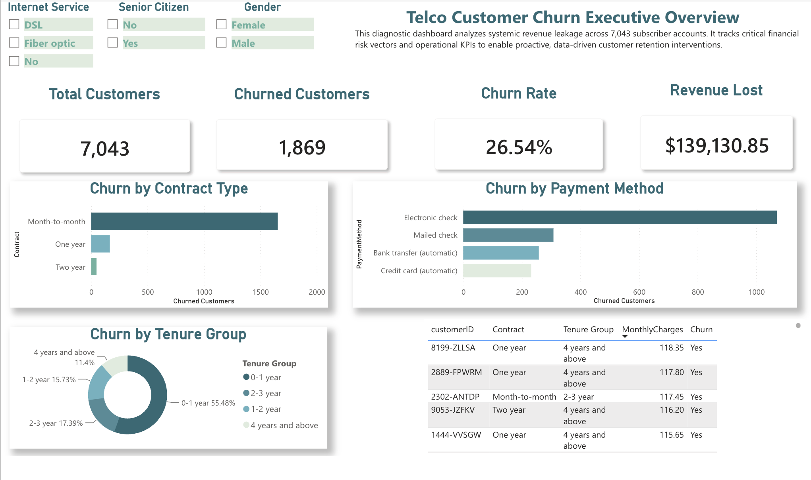
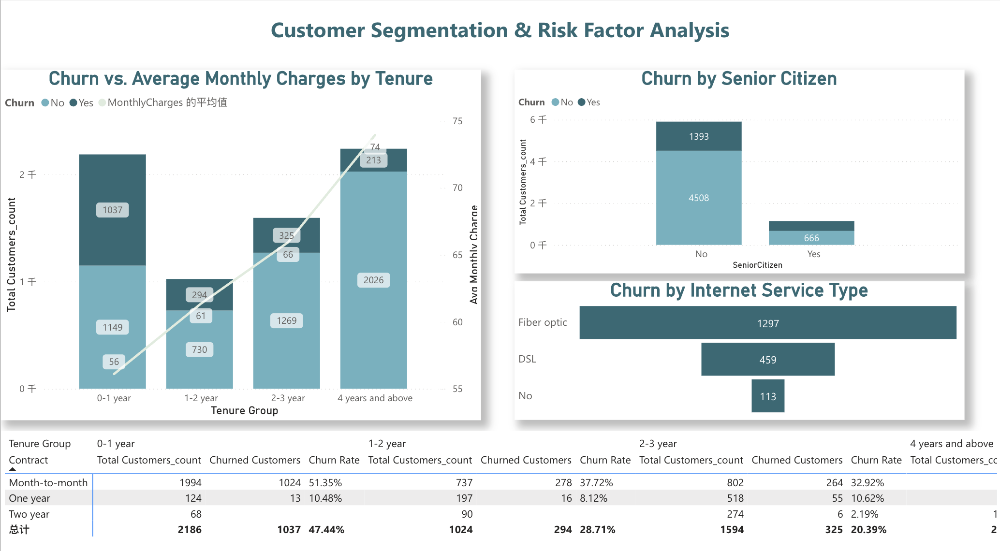

# Telecom Customer Churn Intelligence Dashboard

[](#)
[](#)
[](#)

## Executive Summary
This repository contains a robust, interactive Business Intelligence Dashboard built with Power BI, leveraging the Kaggle Telco Customer Churn dataset (7,043 records). By bridging mathematical rigor with strategic business administration, this project transforms raw operational data into actionable retention assets. 

The analysis is structured to provide both **Global KPI Oversight** for executives and **Granular Risk Mitigation** for product and marketing teams, aiming to identify systemic revenue leakage and deploy data-driven interventions.

---

## Dashboard Previews

*(Note to viewer: Place your high-resolution screenshots in the images/ folder)*

### 1. Executive Baseline & Macro KPIs

*A high-level diagnostic view tracking systemic financial risk vectors and operational KPIs.*

### 2. Customer Segmentation & Risk Factor Analysis

*A deep-dive analytical layer featuring an interactive cross-tabulation matrix to isolate high-risk cohorts.*

---

## Strategic Analytical Flow & Business Narrative

To ensure actionable outcomes, this analysis is driven by a structured, top-down diagnostic consulting framework. We dissect the churn phenomenon through four progressive strategic phases:

### Phase 1: The Executive Baseline (Macro Exposure)
*   **Observation:** The executive overview reveals a baseline Churn Rate of 26.54%, translating to a quantifiable Monthly Revenue Lost of $139,130.85. 
*   **Purpose:** This grounds the project in financial reality, treating churn not just as a lost user metric, but as a severe revenue leakage point requiring immediate operational intervention.

### Phase 2: Financial Vulnerability (Transactional Friction)
*   **Observation:** The cross-tabulation matrix strictly isolates **Month-to-month contracts** as the catastrophic risk zone (51.35% churn rate). Furthermore, customers relying on manual payment methods (e.g., Electronic checks) exhibit significantly higher drop-off rates.
*   **Purpose:** Pinpoints the exact transactional mechanics where the business is losing its grip on the customer base.

### Phase 3: Demographic & Behavioral Profiling (User Personas)
*   **Observation:** By cross-filtering the high-risk financial segments, a distinct profile emerges. The most vulnerable cohort consists of **New Customers (0-1 year tenure)**, **Senior Citizens**, and surprisingly, subscribers to our premium **Fiber Optic** network. 
*   **Purpose:** Transforms abstract percentages into actionable user personas for targeted marketing.

### Phase 4: Product Strategy & Retention Interventions
*   **Strategic Action:** Based on the profiling, we must pivot from passive monitoring to active retention. 
*   **Recommendations:** 
    1.  **For Fiber Optic Users:** Offer heavily discounted *Tech Support* and *Online Security* packages during the critical 0-1 year window to alleviate technical frustration and increase switching costs.
    2.  **For Month-to-month Users:** Push *Automated Billing* incentives and offer complimentary *Streaming TV/Movies* add-ons for users who agree to upgrade to a 1-year contract, locking in long-term revenue.

---

## Technical Architecture & Core DAX Measures

To avoid front-end rendering lag and preserve maximum calculation power, the data model strictly separates visual layer text-formatting from core numerical evaluation logic.

```dax
// 1. Core Base Volume Engine
Total Customers = COUNTROWS('Telco-Customer-Churn')

// 2. Filtered Churn Segment Analyzer
Churned Customers = 
CALCULATE(
    COUNTROWS('Telco-Customer-Churn'),
    'Telco-Customer-Churn'[Churn] = "Yes"
)

// 3. Normalized Operational Attrition Rate
Churn Rate = DIVIDE([Churned Customers], [Total Customers])
